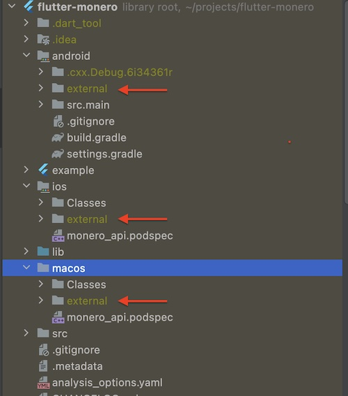

## Set up plugin for a first run

Download binaries from the release folder https://github.com/awaik/monero/releases/tag/v0.1.0

### iOS
1. Copy unzipped binaries files to the folder ios/external   

### Android
1. Copy unzipped binaries files to the folder android/external

### macOS
1. Copy unzipped binaries files to the folder macos/external

2. Remove folder example/build if you are already tried to run example.

3. Run example under iOS, Android, macOS.

## How to test Monero wallet in the example app

Press buttons, step by step.

1. Wallet manager -> Create new
2. Wallet manager -> Open
3. Synchronization -> Set node
4. Synchronization -> Set listener
5. Synchronization -> Check connection
6. Synchronization -> Synchronization status